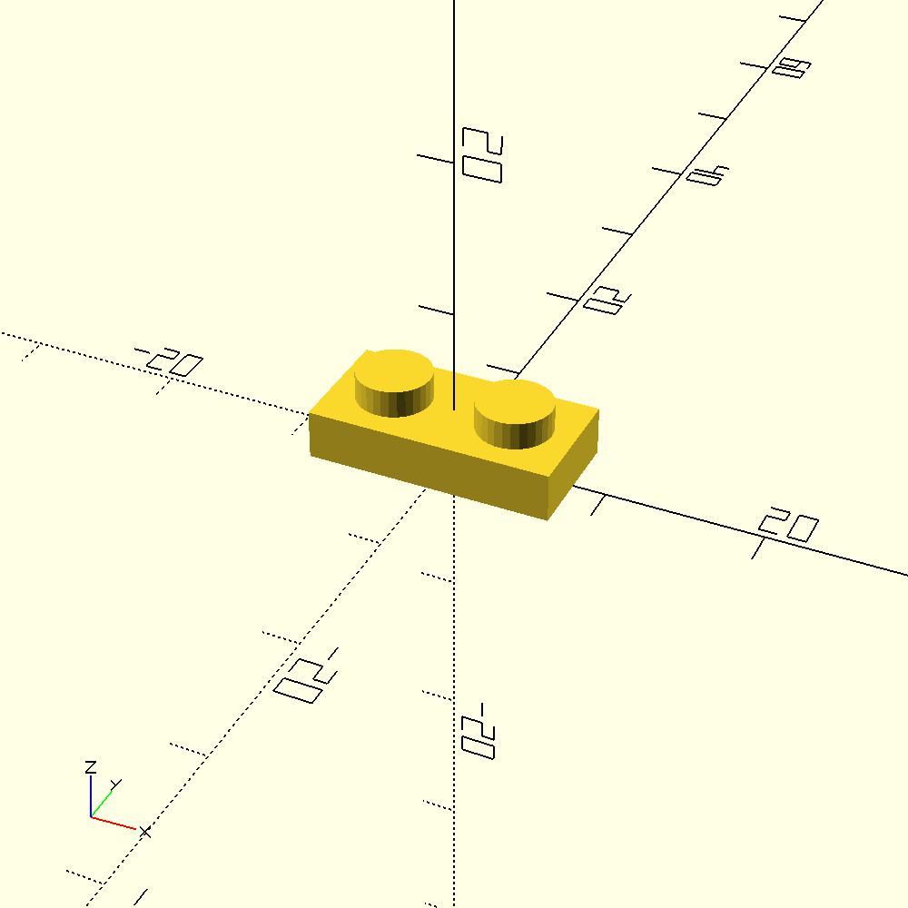
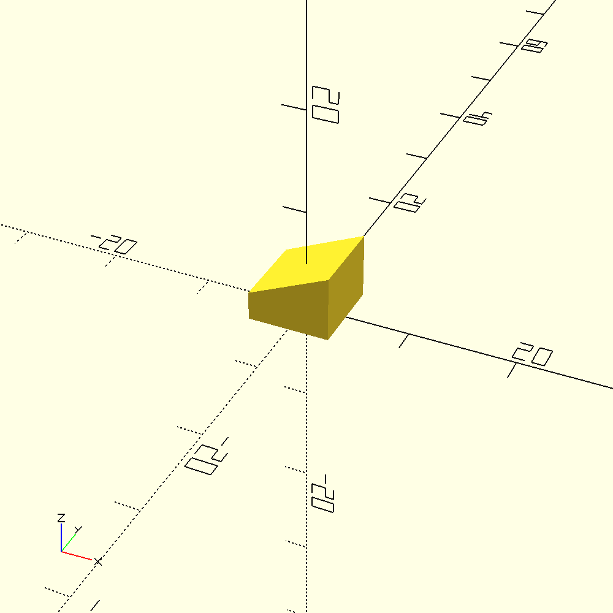
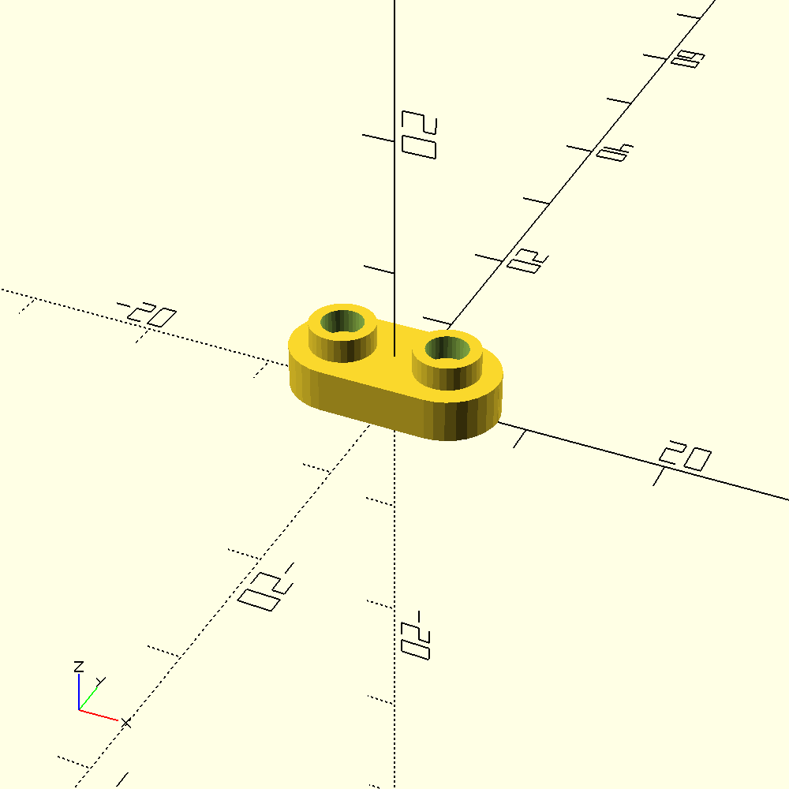

# LEGO.scad

An OpenSCAD LEGO-compatible brick generator.

This parametric brick takes the popular work of http://www.thingiverse.com/thing:5699 a couple steps further, adding easy Customizer support and support for generating wings, smooth-topped tiles, DUPLO-style bricks, sloped bricks, Technic-style holes, and more.

Depending on the resolution of your printer, you may not be able to print pieces that fit exactly with standard LEGO blocks. If you do print any of these bricks, I'd be interested to know whether they fits together with other bricks, especially if you have an SLS or SLA printer.

These blocks are not strictly identical to LEGO bricks, but they should be compatible in most every way.

See http://www.chrisfinke.com/2015/01/27/3d-printed-lego-compatible-bricks/ for more details.

# Usage

The library exposes 2 high-level modules: the `block` module imported from `LEGO.scad` and the `angle_plate` module imported from `LEGO-Angle-Plate.scad`.

## `block()`

The `block` module is most basic module, able to generate most basic parts.

### Parameters

| Parameter| Values| Description|
|---|---|---|
| `width` | int| Width of the block in studs|
| `length` | int| Length of the block in studs. The longest dimension between length and width is automatically re-mapped to length |
| `height` | $\left[\frac{1}{3}-\infty\right]$| Height of the block. A ratio of "1" is a standard LEGO brick height; a ratio of `1/3` is a standard LEGO plate height; `1/2` is a standard DUPLO plate. |
| `type` | `brick`, `tile`, `wing`, `slope`, `curve`, `baseplate`, `round` | What type of block should this be|
| `brand` | `lego`, `duplo` | What brand of block should this be|
| `stud_type` | `solid`, `hollow` | What stud type do you want? Hollow studs allow rods to be pushed into the stud.|
| `block_bottom_type` | `open`, `closed` | Open blocks are the standard, closed bottom blocks can be used for stacking composite shapes.|
| `include_wall_splines` | `yes`, `no` | Should the block wall include splines? Valid only for an open block bottom type.|
| `horizontal_holes` | `yes`, `no` | Should the block include round horizontal holes like the Technics LEGO bricks have?|
| `vertical_axle_holes` | `yes`, `no` | Should the block include vertical cross-shaped axle holes?                                  |
| `wing_type` | `full`, `left`, `right` | What type of wing? Full is suitable for the front of a plane, left/right are for the left/right of a plane. |
| `wing_end_width` | int| The number of studs across the end of the wing. If `width` is odd, this needs to be odd, and the same for even. |
| `wing_base_length` | int| The length of the rectangular portion of the wing, in studs.                                |
| `wing_stud_notches` | `yes`, `no` | Should the wing edges be notched to accept studs below?                                     |
| `slope_stud_rows` | int| How many rows of studs should be left before the slope?                                     |
| `slope_end_height` | int| How much vertical height should be left at the end of the slope?|
| `curve_stud_rows` | int| How many rows of studs should be left before the curve?|
| `curve_type` | `concave`, `convex` | Should the curve be convex or concave?|
| `curve_end_height` | int| How much vertical height should be left at the end of the curve?|
| `roadway_width` | int| If you want a roadway, how wide should it be (in studs)?|
| `roadway_length` | int| How long should the roadway be?|
| `roadway_x` | int| Where should the roadway start (x-value)?|
| `roadway_y` | int| Where should the roadway start (y-value)?|
| `roadway_invert` | `true`, `false` | Should the road be inverted? Useful for minifigure display with one row of studs on the middle. |
| `round_radius` | int | How many studs should be rounded at the corners?|
| `round_stud_notches` | `yes`, `no` | Should the rounded edges be notched to accept studs below?|
| `dual_sided` | `yes`, `no` | SNOT means Studs Not On Top -- bricks with alternative stud configurations. Put studs on the top and bottom? |
| `dual_bottom` | `yes`, `no` | Instead of both sides having studs, both sides can have no studs.|
| `use_reinforcement` | `yes`, `no` | Should extra reinforcement be included to make printing on an FDM printer easier? Ignored for tiles, since they're printed upside-down and don't need the reinforcement. Recommended for block heights less than 1 or for Duplo bricks. |
| `stud_rescale` | float| If your printer prints the blocks correctly except for the stud diameter, use this variable to resize just the studs for your printer. A value of 1.05 will print the studs 105% wider than standard. |
| `stud_top_roundness` | float| If you want stud tops to be curved, specify a value between 0 and 1, where 0 is no roundness and 1 is very round |

# Examples

<table>
<tr>
<td>

### 1x2 Plate

```javascript
use <LEGO.scad>;

block(
    type="brick",
    width=1,
    length=2,
    height=1/3
);
```

</td>
<td>



</td>
</tr>
<tr>
<td>

### 1x1 Sloped Tile

```javascript
use <LEGO.scad>;

block(
    width=1,
    length=1,
    height=2/3,
    type="slope"
);
```

</td>
<td>



</td>
</tr>
<tr>
<td>

### 1x2 Rounded Plate

```javascript
use <LEGO.scad>;
// Increase resolution of curves:
$fn=32;

block(
    type="round",
    width=1,
    length=2,
    height=1/3,
    stud_type="hollow",
    round_radius = .5
);
```

</td>
<td>



</td>
</tr>
</table>