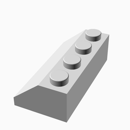
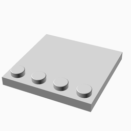

# LEGO.scad

An OpenSCAD LEGO-compatible brick generator.


This parametric brick takes the popular work of http://www.thingiverse.com/thing:5699 a couple steps further, adding easy Customizer support and support for generating wings, smooth-topped tiles, DUPLO-style bricks, sloped bricks, Technic-style holes, and more.

Depending on the resolution of your printer, you may not be able to print pieces that fit exactly with standard LEGO bricks. If you do print any of these bricks, I'd be interested to know whether they fits together with other bricks, especially if you have an SLS or SLA printer.

These bricks are not strictly identical to LEGO bricks, but they should be compatible in most every way.

See http://www.chrisfinke.com/2015/01/27/3d-printed-lego-compatible-bricks/ for more details.

# Usage

The library exposes one modules: `block()`.

## `block()` Parameters

| Parameter | Values | Description |
|---|---|---|
| `width` | int | The width of the brick in studs. |
| `length` | int | The length of the brick in studs. The longest dimension between length and width is automatically re-mapped to length. |
| `height` | $\left[\frac{1}{3}-\infty\right]$ | The height of the brick in brick height units. A height of `1` is a standard LEGO brick height; a height of `1/3` is a standard LEGO plate height; `1/2` is a standard DUPLO plate. |
| `type` | `brick`, `tile`, `wing`, `slope`, `curve`, `baseplate`, `round`, `round-tile` | What type of brick this should be. |
| `brand` | `lego`, `duplo` | Whether the brick should be LEGO-compatible or Duplo-compatible. |
| `stud_type` | `solid`, `hollow`, `open` | What stud type do you want? Hollow studs allow rods to be pushed into the stud; open studs are hollow studs without a bottom. |
| `block_bottom_type` | `open`, `closed` | Open bricks are the standard; closed bottom bricks can be used for stacking composite shapes. |
| `include_wall_splines` | `yes`, `no` | Should the brick wall include splines? Valid only for an open brick bottom type. |
| `wall_splines_rescale` | float | Rescale factor to resize the splines length on the walls. A value of 0.9 will print the walls splines with 90% of the standard length. |
| `horizontal_holes` | `yes`, `no` | Should the brick include round horizontal holes like the Technics LEGO bricks have? |
| `vertical_axle_holes` | `yes`, `no` | Should the brick include vertical cross-shaped axle holes? |
| `wing_type` | `full`, `left`, `right` | What type of wing? Full is suitable for the front of a plane; left/right are for the left/right of a plane. |
| `wing_end_width` | int | The number of studs across the end of the wing. If `width` is odd, this needs to be odd, and the same for even. |
| `wing_base_length` | int | The length of the rectangular portion of the wing, in studs. |
| `slope_stud_rows` | int | How many rows of studs should be left before the slope? |
| `slope_end_height` | int | How much vertical height should be left at the end of the slope? |
| `curve_stud_rows` | int | How many rows of studs should be left before the curve? |
| `curve_type` | `concave`, `convex` | Should the curve be convex or concave? |
| `curve_end_height` | int | How much vertical height should be left at the end of the curve? |
| `roadway_width` | int | If you want a roadway, how wide should it be (in studs)? |
| `roadway_length` | int | How long should the roadway be? |
| `roadway_x` | int | Where should the roadway start (x-value)? |
| `roadway_y` | int | Where should the roadway start (y-value)? |
| `roadway_invert` | `true`, `false` | Should the road be inverted? Useful for minifigure display with one row of studs on the middle. |
| `stud_matrix_string` | string | A single string representing rows of stud positions. See comments in the source file for how this works. |
| `stud_matrix_columns` | int | How many columns per row in the stud matrix string? Not directly related to the size of the baseplate. |
| `stud_matrix_invert` | `true`, `false` | Should the stud matrix be inverted? Asterisk for studs to be removed. |
| `stud_matrix_swapxy` | `true`, `false` | Overall drawing has the larger dimension horizontal. Use this to quickly swap the X and Y understanding of the stud matrix. |
| `stud_notches` | `yes`, `no` | Should the bottom brick edges be notched to accept studs below? This only makes sense for non-rectangular bricks, like wings or round bricks. |
| `round_radius` | int | If the brick is `type=round`, what should the corner radius be, in studs? The default makes for a circular brick. |
| `dual_sided` | `yes`, `no` | Should the brick have studs on both the top and bottom? |
| `dual_bottom` | `yes`, `no` | Instead of both sides having studs, both sides can have no studs. |
| `reinforcement` | `yes`, `no` | Should extra reinforcement be included to make printing on an FDM printer easier? Ignored for tiles, since they can be printed upside-down and don't need the reinforcement. Recommended for brick heights less than 1 or for Duplo bricks. |
| `stud_rescale` | float | If your printer prints the bricks correctly except for the stud diameter, use this variable to resize just the studs for your printer. A value of 1.05 will print the studs 105% wider than standard. |
| `stud_top_roundness` | float | If you want stud tops to be rounded over, specify a value between 0 and 1, where 0 is a cylindrical stud and 1 is a hemispherical stud. |
| `with_posts` | `true`, `false` | Whether posts should be generated underneath bricks. `true` by default. |
| `scale` | float | When scaling bricks up, we want the tolerances to remain static values. This allows for scaling the brick sizes without affecting tolerances. |

# Examples

See the files in examples/ for example usage and the corresponding image in examples/images/ for images of the generated bricks. A selection of them is included below

<table>
<tr>
<td>

### 2x6 Brick

```javascript
use <../LEGO.scad>;

block(
    width=2,
    length=6
);
```

</td>
<td>


</td>
</tr>
<tr>
<td>

### 4x2 Slope

```javascript
use <../LEGO.scad>;

block(
    width=4,
    length=2,
    type="slope"
);
```

</td>
<td>



</td>
</tr>
<tr>
<td>

### Modified 4x4 tile with studs on edge

```javascript
use <../LEGO.scad>;

block(
    width=4,
    length=4,
    height=1/3,
    stud_matrix_string="****
____
____",
    stud_matrix_columns=4
);
```

</td>
<td>



</td>
</tr>
</table>
