# LEGO.scad

An OpenSCAD LEGO-compatible brick generator.


This parametric brick takes the popular work of http://www.thingiverse.com/thing:5699 a couple steps further, adding easy Customizer support and support for generating wings, smooth-topped tiles, DUPLO-style bricks, sloped bricks, Technic-style holes, and more.

Depending on the resolution of your printer, you may not be able to print pieces that fit exactly with standard LEGO bricks. If you do print any of these bricks, I'd be interested to know whether they fits together with other bricks, especially if you have an SLS or SLA printer.

These bricks are not strictly identical to LEGO bricks, but they should be compatible in most every way.

See http://www.chrisfinke.com/2015/01/27/3d-printed-lego-compatible-bricks/ for more details.

## Usage

The library exposes one module: `block()`.

### `block()` Parameters

| Parameter | Values | Description |
|---|---|---|
| `width` | int | The width of the brick in studs. |
| `length` | int | The length of the brick in studs. The longest dimension between length and width is automatically re-mapped to length. |
| `height` | $\left[\frac{1}{3}-\infty\right]$ | The height of the brick in brick height units. A height of `1` is a standard LEGO brick height; a height of `1/3` is a standard LEGO plate height; `1/2` is a standard DUPLO plate. |
| `type` | `brick`, `tile`, `wing`, `slope`, `curve`, `baseplate`, `round`, `round-tile` | What type of brick this should be. |
| `brand` | `lego`, `duplo` | Whether the brick should be LEGO-compatible or Duplo-compatible. |
| `stud_type` | `solid`, `hollow`, `open` | What stud type do you want? Hollow studs allow rods to be pushed into the stud; open studs are hollow studs without a bottom. |
| `block_bottom_type` | `open`, `closed` | Open bricks are the standard; closed bottom bricks can be used for stacking composite shapes. |
| `include_wall_splines` | `yes`, `no` | Should the brick wall include splines? Valid only for an open brick bottom type. |
| `wall_splines_rescale` | float | Rescale factor to resize the splines length on the walls. A value of 0.9 will print the walls splines with 90% of the standard length. |
| `horizontal_axle_holes` | `yes`, `no` | Should the brick include horizontal axle holes like some LEGO Technic bricks have? |
| `horizontal_axle_hole_shape` | `round`, `cross` | What should be the shape of the horizontal holes? |
| `vertical_axle_holes` | `yes`, `no` | Should the brick include vertical axle holes like some LEGO Technic bricks have? |
| `vertical_axle_hole_shape` | `round`, `cross` | What should be the shape of the vertical holes? |
| `wing_type` | `full`, `left`, `right` | What type of wing? Full is suitable for the front of a plane; left/right are for the left/right of a plane. |
| `wing_end_width` | int | The number of studs across the end of the wing. If `width` is odd, this needs to be odd, and the same for even. |
| `wing_base_length` | int | The length of the rectangular portion of the wing, in studs. |
| `slope_stud_rows` | int | How many rows of studs should be left before the slope? |
| `slope_end_height` | int | How much vertical height should be left at the end of the slope? |
| `curve_stud_rows` | int | How many rows of studs should be left before the curve? |
| `curve_type` | `concave`, `convex` | Should the curve be convex or concave? |
| `curve_end_height` | int | How much vertical height should be left at the end of the curve? |
| `roadway_width` | int | If you want a roadway, how wide should it be (in studs)? |
| `roadway_length` | int | How long should the roadway be? |
| `roadway_x` | int | Where should the roadway start (x-value)? |
| `roadway_y` | int | Where should the roadway start (y-value)? |
| `roadway_invert` | `true`, `false` | Should the road be inverted? Useful for minifigure display with one row of studs on the middle. |
| `stud_matrix_string` | string | A single string representing rows of stud positions. See comments in the source file for how this works. |
| `stud_matrix_columns` | int | How many columns per row in the stud matrix string? Not directly related to the size of the baseplate. |
| `stud_matrix_invert` | `true`, `false` | Should the stud matrix be inverted? Asterisk for studs to be removed. |
| `stud_matrix_swapxy` | `true`, `false` | Overall drawing has the larger dimension horizontal. Use this to quickly swap the X and Y understanding of the stud matrix. |
| `stud_notches` | `yes`, `no` | Should the bottom brick edges be notched to accept studs below? This only makes sense for non-rectangular bricks, like wings or round bricks. |
| `round_radius` | int | If the brick is `type=round`, what should the corner radius be, in studs? The default makes for a circular brick. |
| `dual_sided` | `yes`, `no` | Should the brick have studs on both the top and bottom? |
| `dual_bottom` | `yes`, `no` | Instead of both sides having studs, both sides can have no studs. |
| `reinforcement` | `yes`, `no` | Should extra reinforcement be included to make printing on an FDM printer easier? Ignored for tiles, since they can be printed upside-down and don't need the reinforcement. Recommended for brick heights less than 1 or for Duplo bricks. |
| `stud_rescale` | float | If your printer prints the bricks correctly except for the stud diameter, use this variable to resize just the studs for your printer. A value of 1.05 will print the studs 105% wider than standard. |
| `stud_top_roundness` | float | If you want stud tops to be rounded over, specify a value between 0 and 1, where 0 is a cylindrical stud and 1 is a hemispherical stud. |
| `with_posts` | `true`, `false` | Whether posts should be generated underneath bricks. `true` by default. |
| `scale` | float | When scaling bricks up, we want the tolerances to remain static values. This allows for scaling the brick sizes without affecting tolerances. |

## Examples

<table>
<tr><td>

### Part 1126

```javascript
use <LEGO.scad>;

block(
    width=1,
    length=2,
	type="round-tile",
	height=1/3
);

```
</td>
<td>

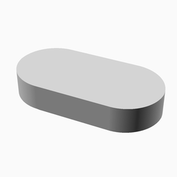

</td></tr>
<tr><td>

### Part 1751

```javascript
use <LEGO.scad>;

block(
    width=4,
    length=4,
    height=1/3,
    type="tile"
);

```
</td>
<td>

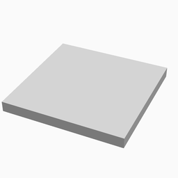

</td></tr>
<tr><td>

### Part 2291

```javascript
use <LEGO.scad>;

block(
    width=2,
    length=10,
	brand="duplo",
	stud_type="hollow"
);

```
</td>
<td>


</td></tr>
<tr><td>

### Part 2300

```javascript
use <LEGO.scad>;

block(
    width=2,
    length=6,
	brand="duplo",
	stud_type="hollow"
);

```
</td>
<td>

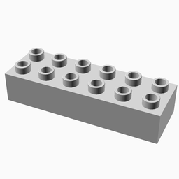

</td></tr>
<tr><td>

### Part 2301

```javascript
use <LEGO.scad>;

block(
    width=2,
    length=3,
	height=2,
	brand="duplo",
	type="curve",
	stud_type="hollow",
	curve_type="concave"
);

```
</td>
<td>


</td></tr>
<tr><td>

### Part 2302

```javascript
use <LEGO.scad>;

block(
    width=2,
    length=3,
	brand="duplo",
	type="curve",
	curve_type="concave",
	stud_type="hollow",
	curve_stud_rows=2
);

```
</td>
<td>

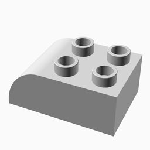

</td></tr>
<tr><td>

### Part 2419

```javascript
use <LEGO.scad>;

block(
    width=6,
    length=3,
    height=1/3,
    type="wing",
    wing_type="full",
    wing_end_width=1,
    stud_notches=true
);

```
</td>
<td>

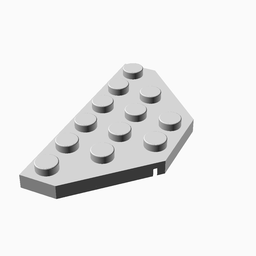

</td></tr>
<tr><td>

### Part 2431

```javascript
use <LEGO.scad>;

block(
    width=1,
    length=4,
    height=1/3,
    type="tile"
);

```
</td>
<td>


</td></tr>
<tr><td>

### Part 2445

```javascript
use <LEGO.scad>;

block(
    width=2,
    length=12,
    height=1/3
);

```
</td>
<td>

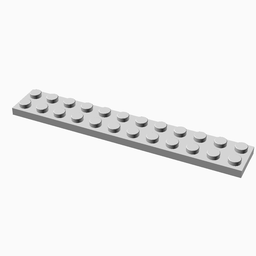

</td></tr>
<tr><td>

### Part 2450

```javascript
use <LEGO.scad>;

block(
    width=3,
    length=3,
    height=1/3,
    type="wing",
    wing_type="left",
    wing_end_width=1,
    stud_notches=true
);

```
</td>
<td>

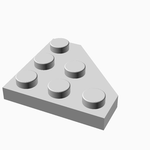

</td></tr>
<tr><td>

### Part 2453

```javascript
use <LEGO.scad>;

block(
    width=1,
    length=1,
    height=5,
    stud_type="hollow"
);

```
</td>
<td>

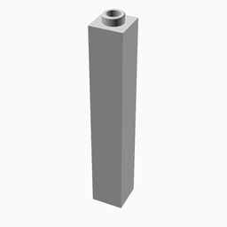

</td></tr>
<tr><td>

### Part 2454

```javascript
use <LEGO.scad>;

block(
    width=1,
    length=2,
    height=5,
    stud_type="hollow"
);

```
</td>
<td>

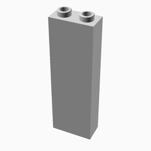

</td></tr>
<tr><td>

### Part 2456

```javascript
use <LEGO.scad>;

block(
    width=2,
    length=6
);

```
</td>
<td>


</td></tr>
<tr><td>

### Part 2465

```javascript
use <LEGO.scad>;

block(
    width=1,
    length=16
);

```
</td>
<td>


</td></tr>
<tr><td>

### Part 3001

```javascript
use <LEGO.scad>;

block(
    width=2,
    length=4
);

```
</td>
<td>

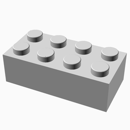

</td></tr>
<tr><td>

### Part 3002

```javascript
use <LEGO.scad>;

block(
    width=2,
    length=3
);

```
</td>
<td>

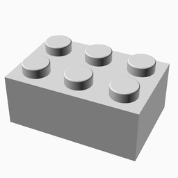

</td></tr>
<tr><td>

### Part 3003

```javascript
use <LEGO.scad>;

block(
    width=2,
    length=2
);

```
</td>
<td>

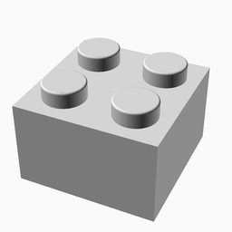

</td></tr>
<tr><td>

### Part 3004

```javascript
use <LEGO.scad>;

block(
    width=1,
    length=2
);

```
</td>
<td>

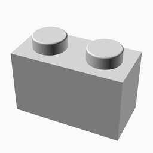

</td></tr>
<tr><td>

### Part 3005

```javascript
use <LEGO.scad>;

block(
    width=1,
    length=1
);

```
</td>
<td>

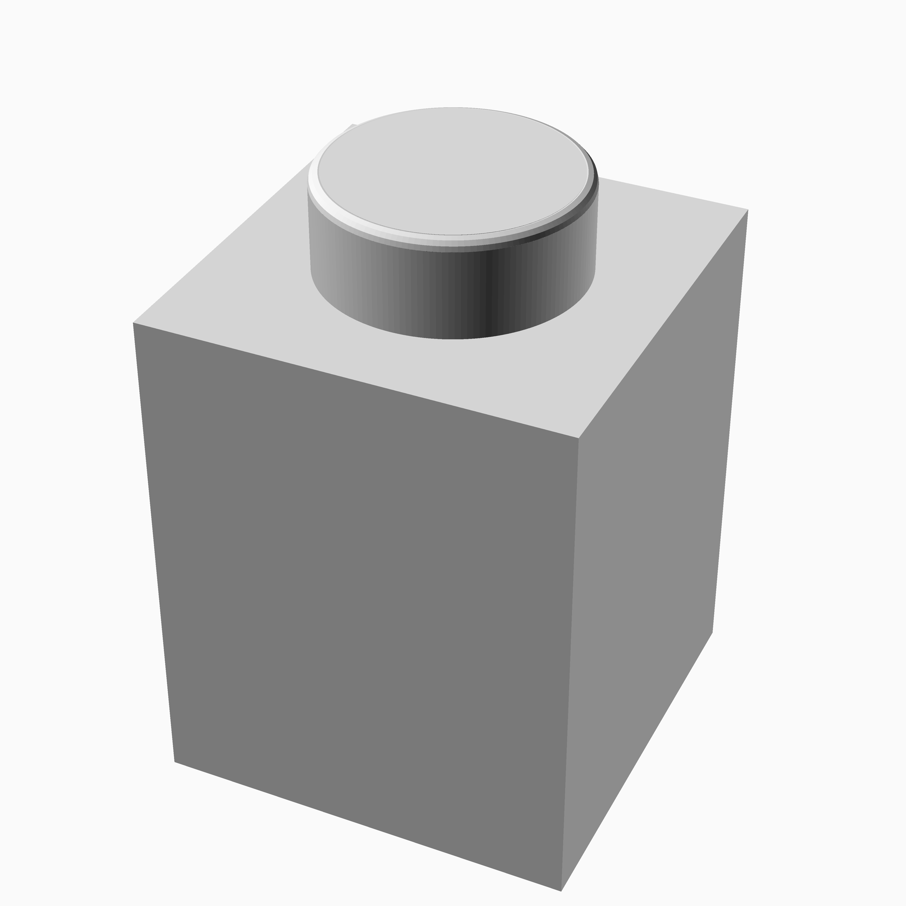

</td></tr>
<tr><td>

### Part 3006

```javascript
use <LEGO.scad>;

block(
    width=2,
    length=10
);

```
</td>
<td>


</td></tr>
<tr><td>

### Part 3007

```javascript
use <LEGO.scad>;

block(
    width=2,
    length=8
);

```
</td>
<td>

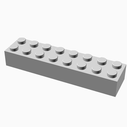

</td></tr>
<tr><td>

### Part 3008

```javascript
use <LEGO.scad>;

block(
    width=1,
    length=8
);

```
</td>
<td>

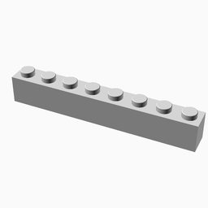

</td></tr>
<tr><td>

### Part 3009

```javascript
use <LEGO.scad>;

block(
    width=1,
    length=6
);

```
</td>
<td>


</td></tr>
<tr><td>

### Part 3010

```javascript
use <LEGO.scad>;

block(
    width=1,
    length=4
);

```
</td>
<td>

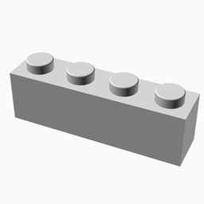

</td></tr>
<tr><td>

### Part 3011

```javascript
use <LEGO.scad>;

block(
    width=2,
    length=4,
	brand="duplo",
	stud_type="hollow"
);

```
</td>
<td>

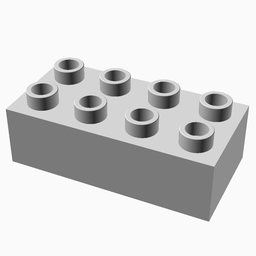

</td></tr>
<tr><td>

### Part 3020

```javascript
use <LEGO.scad>;

block(
    width=2,
    length=4,
    height=1/3
);

```
</td>
<td>

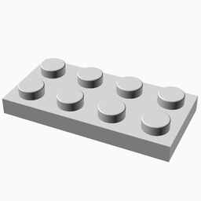

</td></tr>
<tr><td>

### Part 3021

```javascript
use <LEGO.scad>;

block(
    width=2,
    length=3,
    height=1/3
);

```
</td>
<td>


</td></tr>
<tr><td>

### Part 3022

```javascript
use <LEGO.scad>;

block(
    width=2,
    length=2,
    height=1/3
);

```
</td>
<td>

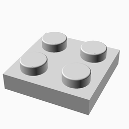

</td></tr>
<tr><td>

### Part 3023

```javascript
use <LEGO.scad>;

block(
    width=1,
    length=2,
    height=1/3
);

```
</td>
<td>

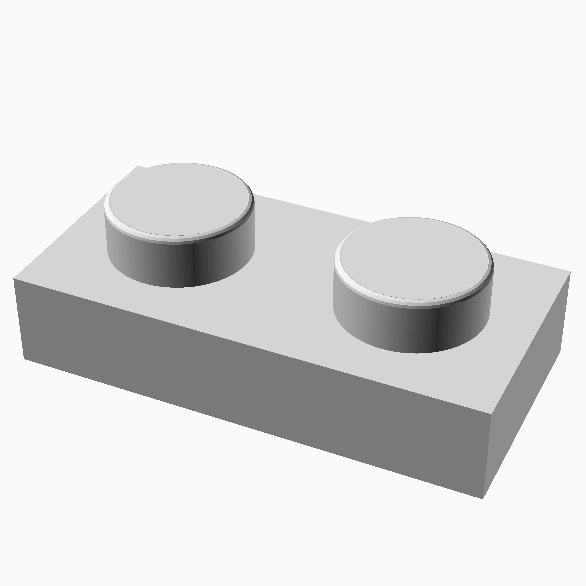

</td></tr>
<tr><td>

### Part 3024

```javascript
use <LEGO.scad>;

block(
    width=1,
    length=1,
    height=1/3
);

```
</td>
<td>

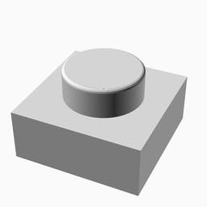

</td></tr>
<tr><td>

### Part 3027

```javascript
use <LEGO.scad>;

block(
    width=6,
    length=16,
    height=1/3
);

```
</td>
<td>

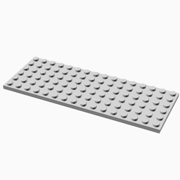

</td></tr>
<tr><td>

### Part 3028

```javascript
use <LEGO.scad>;

block(
    width=6,
    length=12,
    height=1/3
);

```
</td>
<td>


</td></tr>
<tr><td>

### Part 3029

```javascript
use <LEGO.scad>;

block(
    width=4,
    length=12,
    height=1/3
);

```
</td>
<td>

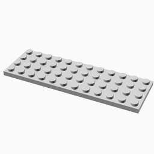

</td></tr>
<tr><td>

### Part 3030

```javascript
use <LEGO.scad>;

block(
    width=4,
    length=10,
    height=1/3
);

```
</td>
<td>

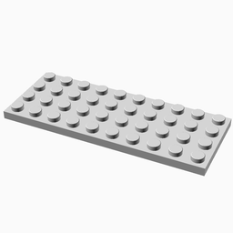

</td></tr>
<tr><td>

### Part 3031

```javascript
use <LEGO.scad>;

block(
    width=4,
    length=4,
    height=1/3
);

```
</td>
<td>

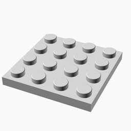

</td></tr>
<tr><td>

### Part 3032

```javascript
use <LEGO.scad>;

block(
    width=4,
    length=6,
    height=1/3
);

```
</td>
<td>


</td></tr>
<tr><td>

### Part 3033

```javascript
use <LEGO.scad>;

block(
    width=6,
    length=10,
    height=1/3
);

```
</td>
<td>

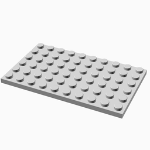

</td></tr>
<tr><td>

### Part 3034

```javascript
use <LEGO.scad>;

block(
    width=2,
    length=8,
    height=1/3
);

```
</td>
<td>

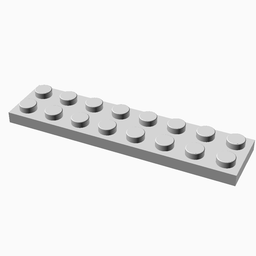

</td></tr>
<tr><td>

### Part 3035

```javascript
use <LEGO.scad>;

block(
    width=4,
    length=8,
    height=1/3
);

```
</td>
<td>

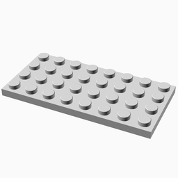

</td></tr>
<tr><td>

### Part 3036

```javascript
use <LEGO.scad>;

block(
    width=6,
    length=8,
    height=1/3
);

```
</td>
<td>

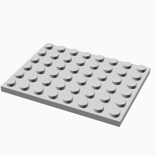

</td></tr>
<tr><td>

### Part 3037

```javascript
use <LEGO.scad>;

block(
    width=4,
    length=2,
    type="slope"
);

```
</td>
<td>


</td></tr>
<tr><td>

### Part 3038

```javascript
use <LEGO.scad>;

block(
    width=3,
    length=2,
    type="slope"
);

```
</td>
<td>

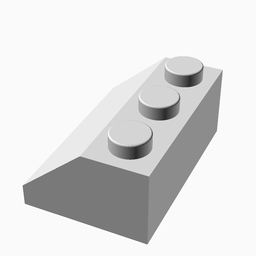

</td></tr>
<tr><td>

### Part 3039

```javascript
use <LEGO.scad>;

block(
    width=2,
    length=2,
    type="slope"
);

```
</td>
<td>

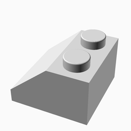

</td></tr>
<tr><td>

### Part 3040

```javascript
use <LEGO.scad>;

block(
    width=1,
    length=2,
    type="slope"
);

```
</td>
<td>

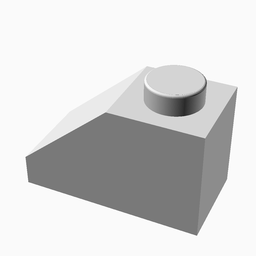

</td></tr>
<tr><td>

### Part 3062

```javascript
use <LEGO.scad>;

block(
    width=1,
    length=1,
	type="round",
	stud_type="hollow"
);

```
</td>
<td>

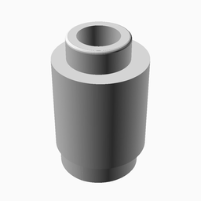

</td></tr>
<tr><td>

### Part 3068

```javascript
use <LEGO.scad>;

block(
    width=2,
    length=2,
    height=1/3,
    type="tile"
);

```
</td>
<td>

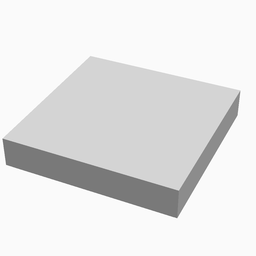

</td></tr>
<tr><td>

### Part 3069

```javascript
use <LEGO.scad>;

block(
    width=1,
    length=2,
    height=1/3,
    type="tile"
);

```
</td>
<td>

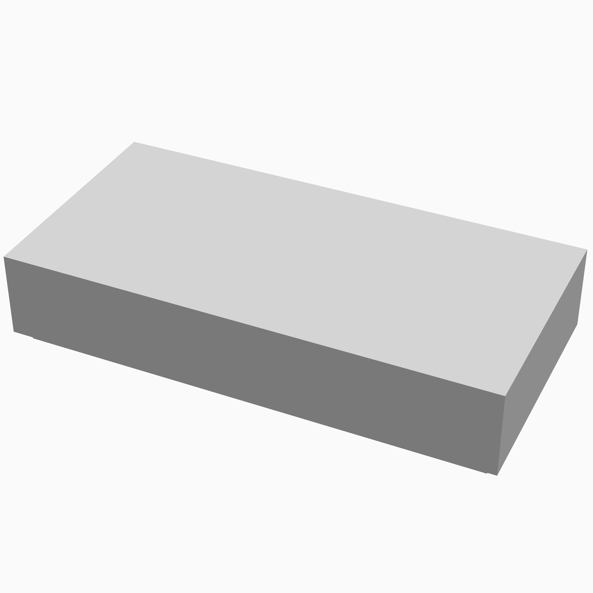

</td></tr>
<tr><td>

### Part 3070

```javascript
use <LEGO.scad>;

block(
    width=1,
    length=1,
    height=1/3,
    type="tile"
);

```
</td>
<td>

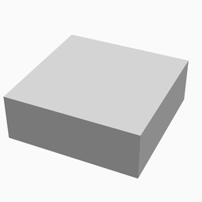

</td></tr>
<tr><td>

### Part 3254

```javascript
use <LEGO.scad>;

block(
    width=1,
    length=2,
    height=2
);

```
</td>
<td>

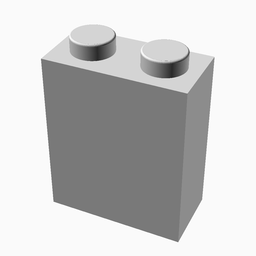

</td></tr>
<tr><td>

### Part 3297

```javascript
use <LEGO.scad>;

block(
    width=4,
    length=3,
    type="slope"
);

```
</td>
<td>

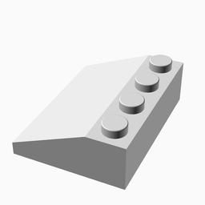

</td></tr>
<tr><td>

### Part 3298

```javascript
use <LEGO.scad>;

block(
    width=2,
    length=3,
    type="slope"
);

```
</td>
<td>


</td></tr>
<tr><td>

### Part 3437

```javascript
use <LEGO.scad>;

block(
    width=2,
    length=2,
	brand="duplo",
	stud_type="hollow"
);

```
</td>
<td>

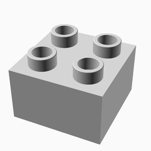

</td></tr>
<tr><td>

### Part 3456

```javascript
use <LEGO.scad>;

block(
    width=6,
    length=14,
    height=1/3
);

```
</td>
<td>

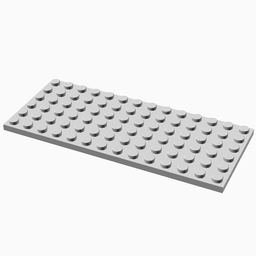

</td></tr>
<tr><td>

### Part 3460

```javascript
use <LEGO.scad>;

block(
    width=1,
    length=8,
    height=1/3
);

```
</td>
<td>


</td></tr>
<tr><td>

### Part 3544

```javascript
use <LEGO.scad>;

block(
    width=3,
    length=8,
    height=1/3,
    type="wing",
    wing_type="left",
    stud_notches=true,
	wing_base_length=1,
	wing_end_width=1
);

```
</td>
<td>

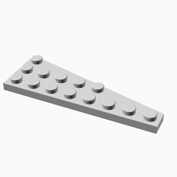

</td></tr>
<tr><td>

### Part 3545

```javascript
use <LEGO.scad>;

block(
    width=3,
    length=8,
    height=1/3,
    type="wing",
    wing_type="right",
    stud_notches=true,
	wing_base_length=1,
	wing_end_width=1
);

```
</td>
<td>

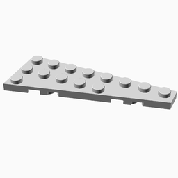

</td></tr>
<tr><td>

### Part 3622

```javascript
use <LEGO.scad>;

block(
    width=1,
    length=3
);

```
</td>
<td>

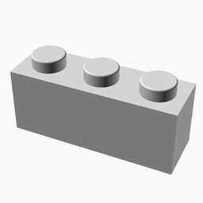

</td></tr>
<tr><td>

### Part 3623

```javascript
use <LEGO.scad>;

block(
    width=1,
    length=3,
    height=1/3
);

```
</td>
<td>

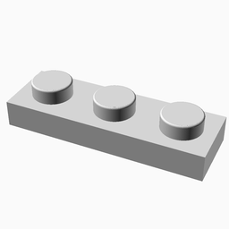

</td></tr>
<tr><td>

### Part 3666

```javascript
use <LEGO.scad>;

block(
    width=1,
    length=6,
    height=1/3
);

```
</td>
<td>


</td></tr>
<tr><td>

### Part 3678

```javascript
use <LEGO.scad>;

block(
    width=2,
    length=2,
    height=2,
    type="slope"
);

```
</td>
<td>


</td></tr>
<tr><td>

### Part 3702

```javascript
use <LEGO.scad>;

block(
    width=1,
    length=8,
    horizontal_axle_holes=true,
    horizontal_axle_hole_shape="round",
);


```
</td>
<td>


</td></tr>
<tr><td>

### Part 3709

```javascript
use <LEGO.scad>;

block(
    width=4,
    length=2,
    height=1/3,
    vertical_axle_holes=true,
    vertical_axle_hole_shape="round",
    type="bricks"
);

```
</td>
<td>

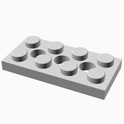

</td></tr>
<tr><td>

### Part 3710

```javascript
use <LEGO.scad>;

block(
    width=1,
    length=4,
    height=1/3
);

```
</td>
<td>

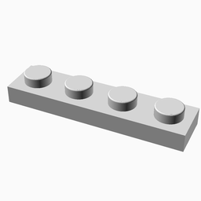

</td></tr>
<tr><td>

### Part 3766

```javascript
use <LEGO.scad>;

block(
    width=4,
    length=6,
	type="round",
	height=1/3,
	stud_notches=true
);

```
</td>
<td>

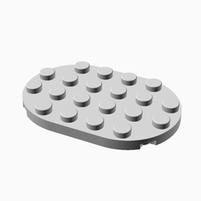

</td></tr>
<tr><td>

### Part 3795

```javascript
use <LEGO.scad>;

block(
    width=2,
    length=6,
    height=1/3
);

```
</td>
<td>

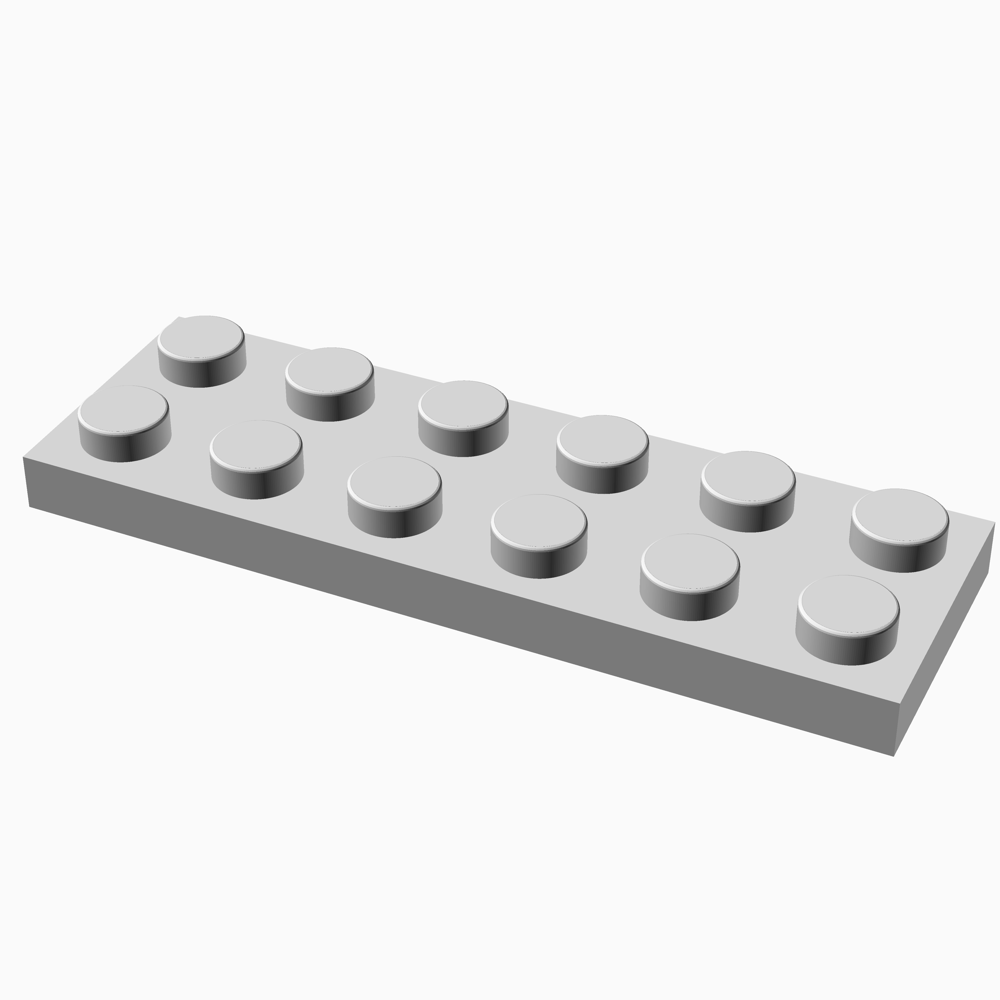

</td></tr>
<tr><td>

### Part 3811

```javascript
use <LEGO.scad>;

block(
    width=32,
    length=32,
    type="baseplate"
);

```
</td>
<td>


</td></tr>
<tr><td>

### Part 3832

```javascript
use <LEGO.scad>;

block(
    width=2,
    length=10,
    height=1/3
);

```
</td>
<td>


</td></tr>
<tr><td>

### Part 3857

```javascript
use <LEGO.scad>;

block(
    width=16,
    length=32,
    type="baseplate"
);

```
</td>
<td>

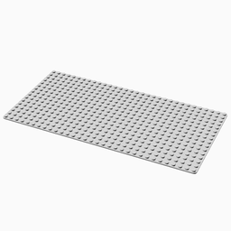

</td></tr>
<tr><td>

### Part 3958

```javascript
use <LEGO.scad>;

block(
    width=6,
    length=6,
    height=1/3
);

```
</td>
<td>


</td></tr>
<tr><td>

### Part 4032

```javascript
use <LEGO.scad>;

block(
    width=2,
    length=2,
	type="round",
	height=1/3,
	vertical_axle_holes=true,
	vertical_axle_hole_shape="cross",
	stud_notches=true
);

```
</td>
<td>


</td></tr>
<tr><td>

### Part 4161

```javascript
use <LEGO.scad>;

block(
    width=3,
    length=3,
    type="slope"
);

```
</td>
<td>


</td></tr>
<tr><td>

### Part 4162

```javascript
use <LEGO.scad>;

block(
    width=1,
    length=8,
    height=1/3,
    type="tile"
);

```
</td>
<td>


</td></tr>
<tr><td>

### Part 4186

```javascript
use <LEGO.scad>;

block(
    width=48,
    length=48,
    type="baseplate"
);

```
</td>
<td>


</td></tr>
<tr><td>

### Part 4196

```javascript
use <LEGO.scad>;

block(
    width=6,
    length=12,
	brand="duplo",
	stud_type="hollow",
	height=1/2
);

```
</td>
<td>


</td></tr>
<tr><td>

### Part 4199

```javascript
use <LEGO.scad>;

block(
    width=2,
    length=8,
	brand="duplo",
	stud_type="hollow"
);

```
</td>
<td>


</td></tr>
<tr><td>

### Part 4268

```javascript
use <LEGO.scad>;

block(
    width=24,
    length=24,
	brand="duplo",
	height=1/3
);

```
</td>
<td>


</td></tr>
<tr><td>

### Part 4282

```javascript
use <LEGO.scad>;

block(
    width=2,
    length=16,
    height=1/3
);

```
</td>
<td>


</td></tr>
<tr><td>

### Part 4286

```javascript
use <LEGO.scad>;

block(
    width=1,
    length=3,
    type="slope"
);

```
</td>
<td>


</td></tr>
<tr><td>

### Part 4445

```javascript
use <LEGO.scad>;

block(
    width=8,
    length=2,
    type="slope"
);

```
</td>
<td>


</td></tr>
<tr><td>

### Part 4460

```javascript
use <LEGO.scad>;

block(
    width=1,
    length=2,
    height=3,
    type="slope",
    stud_type="hollow"
);

```
</td>
<td>


</td></tr>
<tr><td>

### Part 4477

```javascript
use <LEGO.scad>;

block(
    width=1,
    length=10,
    height=1/3
);

```
</td>
<td>


</td></tr>
<tr><td>

### Part 4672

```javascript
use <LEGO.scad>;

block(
    width=4,
    length=8,
	brand="duplo",
	stud_type="hollow",
	height=1/2
);

```
</td>
<td>


</td></tr>
<tr><td>

### Part 6106

```javascript
use <LEGO.scad>;

block(
    width=6,
    length=6,
    height=1/3,
    type="wing",
    wing_type="left",
    wing_end_width=2,
    wing_base_length=3,
    stud_notches=true
);

```
</td>
<td>


</td></tr>
<tr><td>

### Part 6111

```javascript
use <LEGO.scad>;

block(
    width=1,
    length=10
);

```
</td>
<td>


</td></tr>
<tr><td>

### Part 6112

```javascript
use <LEGO.scad>;

block(
    width=1,
    length=12
);

```
</td>
<td>


</td></tr>
<tr><td>

### Part 6141

```javascript
use <LEGO.scad>;

block(
    width=1,
    length=1,
	type="round",
	height=1/3
);

```
</td>
<td>


</td></tr>
<tr><td>

### Part 6178

```javascript
use <LEGO.scad>;

block(
    width=6,
    length=12,
    height=1/3,
    stud_matrix_string="************
*__________*
*__________*
*__________*
*__________*
*__________*
",
    stud_matrix_columns=12
);

```
</td>
<td>


</td></tr>
<tr><td>

### Part 6179

```javascript
use <LEGO.scad>;

block(
    width=4,
    length=4,
    height=1/3,
    stud_matrix_string="****
____
____
____",
    stud_matrix_columns=4
);

```
</td>
<td>


</td></tr>
<tr><td>

### Part 6180

```javascript
use <LEGO.scad>;

block(
    width=4,
    length=6,
    height=1/3,
    stud_matrix_string="******
*____*
*____*
*____*",
    stud_matrix_columns=6
);

```
</td>
<td>


</td></tr>
<tr><td>

### Part 6205

```javascript
use <LEGO.scad>;

block(
    width=6,
    length=16,
    height=1/3,
    stud_matrix_string="****************
*______________*
*______________*
*______________*
*______________*
*______________*
",
    stud_matrix_columns=16
);

```
</td>
<td>


</td></tr>
<tr><td>

### Part 6474

```javascript
use <LEGO.scad>;

block(
    width=2,
    length=2,
	height=1.5,
	brand="duplo",
	type="slope"
);

```
</td>
<td>


</td></tr>
<tr><td>

### Part 6490

```javascript
use <LEGO.scad>;

block(
    width=8,
    length=16,
	brand="duplo",
	stud_type="hollow",
	height=1/2
);

```
</td>
<td>


</td></tr>
<tr><td>

### Part 6636

```javascript
use <LEGO.scad>;

block(
    width=1,
    length=6,
    height=1/3,
    type="tile"
);

```
</td>
<td>


</td></tr>
<tr><td>

### Part 10202

```javascript
use <LEGO.scad>;

block(
    width=6,
    length=6,
    height=1/3,
    type="tile"
);

```
</td>
<td>


</td></tr>
<tr><td>

### Part 11169

```javascript
use <LEGO.scad>;

block(
    width=2,
    length=2,
	height=1.5,
	brand="duplo",
	type="curve",
	stud_type="hollow",
	curve_stud_rows=2,
	curve_type="concave"
);

```
</td>
<td>


</td></tr>
<tr><td>

### Part 11170

```javascript
use <LEGO.scad>;

block(
    width=2,
    length=2,
	height=1.5,
	brand="duplo",
	type="curve",
	curve_type="convex",
	stud_type="hollow"
);

```
</td>
<td>


</td></tr>
<tr><td>

### Part 11212

```javascript
use <LEGO.scad>;

block(
    width=3,
    length=3,
    height=1/3
);

```
</td>
<td>


</td></tr>
<tr><td>

### Part 11344

```javascript
use <LEGO.scad>;

block(
    width=2,
    length=3,
	height=2,
	brand="duplo",
	type="curve",
	curve_type="convex",
	stud_type="hollow",
	curve_stud_rows=2
);

```
</td>
<td>


</td></tr>
<tr><td>

### Part 14181

```javascript
use <LEGO.scad>;

block(
    width=4,
    length=9,
    height=1/3,
    type="wing",
    wing_type="full",
    wing_base_length=4,
    wing_end_width=1,
    stud_notches=true
);

```
</td>
<td>


</td></tr>
<tr><td>

### Part 14716

```javascript
use <LEGO.scad>;

block(
    width=1,
    length=1,
    height=3
);

```
</td>
<td>


</td></tr>
<tr><td>

### Part 14721

```javascript
use <LEGO.scad>;

block(
    width=4,
    length=4,
	brand="duplo",
	stud_type="hollow",
	height=1/2
);

```
</td>
<td>


</td></tr>
<tr><td>

### Part 14769

```javascript
use <LEGO.scad>;

block(
    width=2,
    length=2,
	type="round-tile",
	height=1/3,
	stud_notches=true
);

```
</td>
<td>


</td></tr>
<tr><td>

### Part 22886

```javascript
use <LEGO.scad>;

block(
    width=1,
    length=2,
    height=3
);

```
</td>
<td>


</td></tr>
<tr><td>

### Part 23949

```javascript
use <LEGO.scad>;

block(
    width=6,
    length=2,
    type="slope"
);

```
</td>
<td>


</td></tr>
<tr><td>

### Part 24299

```javascript
use <LEGO.scad>;

block(
    width=2,
    length=2,
    height=1/3,
    type="wing",
    wing_type="left",
    stud_notches=true
);

```
</td>
<td>


</td></tr>
<tr><td>

### Part 24307

```javascript
use <LEGO.scad>;

block(
    width=2,
    length=2,
    height=1/3,
    type="wing",
    wing_type="right",
    stud_notches=true
);

```
</td>
<td>


</td></tr>
<tr><td>

### Part 25549

```javascript
use <LEGO.scad>;

block(
    width=4,
    length=6,
	brand="duplo",
	stud_type="hollow",
	height=1/2
);

```
</td>
<td>


</td></tr>
<tr><td>

### Part 26603

```javascript
use <LEGO.scad>;

block(
    width=2,
    length=3,
    height=1/3,
    type="tile"
);

```
</td>
<td>


</td></tr>
<tr><td>

### Part 30145

```javascript
use <LEGO.scad>;

block(
    width=2,
    length=2,
    height=3
);

```
</td>
<td>


</td></tr>
<tr><td>

### Part 30249

```javascript
use <LEGO.scad>;

block(
    width=1,
    length=6,
    height=5,
    type="slope",
    slope_stud_rows=2,
    stud_type="hollow"
);

```
</td>
<td>


</td></tr>
<tr><td>

### Part 30355

```javascript
use <LEGO.scad>;

block(
    width=6,
    length=12,
    height=1/3,
    type="wing",
    wing_type="left",
    wing_base_length=4,
    wing_end_width=3,
    stud_notches=true
);

```
</td>
<td>


</td></tr>
<tr><td>

### Part 30356

```javascript
use <LEGO.scad>;

block(
    width=6,
    length=12,
    height=1/3,
    type="wing",
    wing_type="right",
    wing_base_length=4,
    wing_end_width=3,
    stud_notches=true
);

```
</td>
<td>


</td></tr>
<tr><td>

### Part 30363

```javascript
use <LEGO.scad>;

block(
    width=2,
    length=4,
    type="slope"
);

```
</td>
<td>


</td></tr>
<tr><td>

### Part 30503

```javascript
use <LEGO.scad>;

block(
    width=4,
    length=4,
    height=1/3,
    type="wing",
    wing_type="left",
    wing_end_width=1,
    stud_notches=true
);

```
</td>
<td>


</td></tr>
<tr><td>

### Part 30504

```javascript
use <LEGO.scad>;

block(
    width=8,
    length=8,
    height=1/3,
    type="wing",
    wing_type="left",
    wing_end_width=1,
    stud_notches=true
);

```
</td>
<td>


</td></tr>
<tr><td>

### Part 31110

```javascript
use <LEGO.scad>;

block(
    width=2,
    length=2,
	brand="duplo",
	stud_type="hollow",
	height=2
);

```
</td>
<td>


</td></tr>
<tr><td>

### Part 32064

```javascript
use <LEGO.scad>;

block(
    width=1,
    length=2,
    horizontal_axle_holes=true,
    horizontal_axle_hole_shape="cross",
);

```
</td>
<td>


</td></tr>
<tr><td>

### Part 33243

```javascript
use <LEGO.scad>;

block(
    width=1,
    length=3,
	type="curve",
	curve_type="concave",
	height=2,
	stud_type="hollow"
);

```
</td>
<td>


</td></tr>
<tr><td>

### Part 33909

```javascript
use <LEGO.scad>;

block(
    width=2,
    length=2,
    height=1/3,
    stud_matrix_string="**",
    stud_matrix_columns=2
);

```
</td>
<td>


</td></tr>
<tr><td>

### Part 35114

```javascript
use <LEGO.scad>;

block(
    width=2,
    length=3,
	brand="duplo",
	type="slope"
);

```
</td>
<td>


</td></tr>
<tr><td>

### Part 35480

```javascript
use <LEGO.scad>;

block(
    width=1,
    length=2,
	type="round",
	height=1/3,
	stud_type="hollow"
);

```
</td>
<td>


</td></tr>
<tr><td>

### Part 40666

```javascript
use <LEGO.scad>;

block(
    width=2,
    length=4,
	brand="duplo",
	stud_type="hollow",
	height=1/2
);

```
</td>
<td>


</td></tr>
<tr><td>

### Part 41539

```javascript
use <LEGO.scad>;

block(
    width=8,
    length=8,
    height=1/3
);

```
</td>
<td>


</td></tr>
<tr><td>

### Part 41740

```javascript
use <LEGO.scad>;

block(
    width=1,
    length=4,
    height=1/3,
    stud_matrix_string="*__*",
    stud_matrix_columns=4
);

```
</td>
<td>


</td></tr>
<tr><td>

### Part 41769

```javascript
use <LEGO.scad>;

block(
    width=2,
    length=4,
    height=1/3,
    type="wing",
    wing_type="right",
    wing_base_length=1,
    wing_end_width=2,
    stud_notches=true
);


```
</td>
<td>


</td></tr>
<tr><td>

### Part 41770

```javascript
use <LEGO.scad>;

block(
    width=2,
    length=4,
    height=1/3,
    type="wing",
    wing_type="left",
    wing_base_length=1,
    wing_end_width=2,
    stud_notches=true
);


```
</td>
<td>


</td></tr>
<tr><td>

### Part 42022

```javascript
use <LEGO.scad>;

block(
    width=1,
    length=6,
	type="curve",
	curve_type="convex",
	height=2,
	curve_stud_rows=2
);

```
</td>
<td>


</td></tr>
<tr><td>

### Part 43722

```javascript
use <LEGO.scad>;

block(
    width=2,
    length=3,
    height=1/3,
    type="wing",
    wing_type="right",
    wing_base_length=0,
    wing_end_width=1,
    stud_notches=true
);

```
</td>
<td>


</td></tr>
<tr><td>

### Part 43723

```javascript
use <LEGO.scad>;

block(
    width=2,
    length=3,
    height=1/3,
    type="wing",
    wing_type="left",
    wing_base_length=0,
    wing_end_width=1,
    stud_notches=true
);

```
</td>
<td>


</td></tr>
<tr><td>

### Part 44126

```javascript
use <LEGO.scad>;

block(
    width=2,
    length=6,
	type="curve",
	curve_type="convex",
	height=2,
	curve_stud_rows=2
);

```
</td>
<td>


</td></tr>
<tr><td>

### Part 44524

```javascript
use <LEGO.scad>;

block(
    width=2,
    length=8,
	brand="duplo",
	stud_type="hollow",
	height=1/2
);

```
</td>
<td>


</td></tr>
<tr><td>

### Part 47397

```javascript
use <LEGO.scad>;

block(
    width=3,
    length=12,
    height=1/3,
    type="wing",
    wing_type="left",
    wing_base_length=1,
    wing_end_width=1,
    stud_notches=true
);

```
</td>
<td>


</td></tr>
<tr><td>

### Part 47398

```javascript
use <LEGO.scad>;

block(
    width=3,
    length=12,
    height=1/3,
    type="wing",
    wing_type="right",
    wing_base_length=1,
    wing_end_width=1,
    stud_notches=true
);

```
</td>
<td>


</td></tr>
<tr><td>

### Part 48205

```javascript
use <LEGO.scad>;

block(
    width=4,
    length=6,
    height=1/3,
    type="wing",
    wing_type="right",
    wing_base_length=0,
    wing_end_width=1,
    stud_notches=true
);

```
</td>
<td>


</td></tr>
<tr><td>

### Part 48208

```javascript
use <LEGO.scad>;

block(
    width=4,
    length=6,
    height=1/3,
    type="wing",
    wing_type="left",
    wing_base_length=0,
    wing_end_width=1,
    stud_notches=true
);

```
</td>
<td>


</td></tr>
<tr><td>

### Part 49311

```javascript
use <LEGO.scad>;

block(
    width=1,
    length=4,
    height=3
);

```
</td>
<td>


</td></tr>
<tr><td>

### Part 49570

```javascript
use <LEGO.scad>;

block(
    width=2,
    length=4,
	height=3,
	brand="duplo",
	type="slope"
);

```
</td>
<td>


</td></tr>
<tr><td>

### Part 49618

```javascript
use <LEGO.scad>;

block(
    width=1,
    length=8,
    height=3,
    type="slope"
);

```
</td>
<td>


</td></tr>
<tr><td>

### Part 50303

```javascript
use <LEGO.scad>;

block(
    width=6,
    length=7,
    height=1/3,
    type="wing",
    wing_type="full",
    wing_base_length=3,
    wing_end_width=2,
    stud_notches=true
);


```
</td>
<td>


</td></tr>
<tr><td>

### Part 50304

```javascript
use <LEGO.scad>;

block(
    width=3,
    length=8,
    height=1/3,
    type="wing",
    wing_type="right",
    wing_base_length=3,
    wing_end_width=1,
    stud_notches=true
);

```
</td>
<td>


</td></tr>
<tr><td>

### Part 50305

```javascript
use <LEGO.scad>;

block(
    width=3,
    length=8,
    height=1/3,
    type="wing",
    wing_type="left",
    wing_base_length=3,
    wing_end_width=1,
    stud_notches=true
);

```
</td>
<td>


</td></tr>
<tr><td>

### Part 51262

```javascript
use <LEGO.scad>;

block(
    width=8,
    length=8,
	brand="duplo",
	stud_type="hollow",
	height=1/2
);

```
</td>
<td>


</td></tr>
<tr><td>

### Part 51739

```javascript
use <LEGO.scad>;

block(
    width=4,
    length=2,
    height=1/3,
    type="wing",
    wing_type="full",
    wing_base_length=0,
    wing_end_width=1,
    stud_notches=true
);

```
</td>
<td>


</td></tr>
<tr><td>

### Part 54200

```javascript
use <LEGO.scad>;

block(
    width=1,
    length=1,
    height=2/3,
    type="slope"
);

```
</td>
<td>


</td></tr>
<tr><td>

### Part 54383

```javascript
use <LEGO.scad>;

block(
    width=3,
    length=6,
    height=1/3,
    type="wing",
    wing_type="right",
    wing_base_length=0,
    wing_end_width=1,
    stud_notches=true
);

```
</td>
<td>


</td></tr>
<tr><td>

### Part 54384

```javascript
use <LEGO.scad>;

block(
    width=3,
    length=6,
    height=1/3,
    type="wing",
    wing_type="left",
    wing_base_length=0,
    wing_end_width=1,
    stud_notches=true
);

```
</td>
<td>


</td></tr>
<tr><td>

### Part 60477

```javascript
use <LEGO.scad>;

block(
    width=1,
    length=4,
    type="slope"
);

```
</td>
<td>


</td></tr>
<tr><td>

### Part 60479

```javascript
use <LEGO.scad>;

block(
    width=1,
    length=12,
    height=1/3
);

```
</td>
<td>


</td></tr>
<tr><td>

### Part 60481

```javascript
use <LEGO.scad>;

block(
    width=1,
    length=2,
    height=2,
    type="slope"
);

```
</td>
<td>


</td></tr>
<tr><td>

### Part 63864

```javascript
use <LEGO.scad>;

block(
    width=1,
    length=3,
    height=1/3,
    type="tile"
);

```
</td>
<td>


</td></tr>
<tr><td>

### Part 63871

```javascript
use <LEGO.scad>;

block(
    width=2,
    length=3,
	height=2,
	brand="duplo",
	type="slope"
);

```
</td>
<td>


</td></tr>
<tr><td>

### Part 65140

```javascript
use <LEGO.scad>;

block(
    width=8,
    length=8,
	type="round",
	height=1/3,
	stud_notches=true,
	round_radius=2
);

```
</td>
<td>


</td></tr>
<tr><td>

### Part 65474

```javascript
use <LEGO.scad>;

block(
    width=6,
    length=8,
	type="round-tile",
	height=1/3,
	stud_notches=true
);

```
</td>
<td>


</td></tr>
<tr><td>

### Part 65734

```javascript
use <LEGO.scad>;

block(
    width=1,
    length=4,
	type="curve",
	curve_type="convex",
	height=2+(2/3)
);

```
</td>
<td>


</td></tr>
<tr><td>

### Part 66857

```javascript
use <LEGO.scad>;

block(
    width=2,
    length=4,
	type="round-tile",
	height=1/3,
	stud_notches=true
);

```
</td>
<td>


</td></tr>
<tr><td>

### Part 67095

```javascript
use <LEGO.scad>;

block(
    width=3,
    length=3,
	type="round-tile",
	height=1/3,
	stud_notches=true
);

```
</td>
<td>


</td></tr>
<tr><td>

### Part 68869

```javascript
use <LEGO.scad>;

block(
    width=4,
    length=4,
	type="round-tile",
	height=2/3,
	stud_notches=true,
	round_radius=1
);


```
</td>
<td>


</td></tr>
<tr><td>

### Part 69729

```javascript
use <LEGO.scad>;

block(
    width=2,
    length=6,
    height=1/3,
    type="tile"
);

```
</td>
<td>


</td></tr>
<tr><td>

### Part 70676

```javascript
use <LEGO.scad>;

block(
    width=2,
    length=2,
	height=2,
	brand="duplo",
	type="slope"
);

```
</td>
<td>


</td></tr>
<tr><td>

### Part 76371

```javascript
use <LEGO.scad>;

block(
    width=2,
    length=1,
	brand="duplo",
	stud_type="hollow",
	height=2
);

```
</td>
<td>


</td></tr>
<tr><td>

### Part 77850

```javascript
use <LEGO.scad>;

block(
    width=1,
    length=3,
	type="round",
	height=1/3,
	stud_type="hollow"
);

```
</td>
<td>


</td></tr>
<tr><td>

### Part 78329

```javascript
use <LEGO.scad>;

block(
    width=1,
    length=5,
    height=1/3
);

```
</td>
<td>


</td></tr>
<tr><td>

### Part 78443

```javascript
use <LEGO.scad>;

block(
    width=2,
    length=6,
    height=1/3,
    type="wing",
    wing_type="left",
    wing_base_length=1,
    wing_end_width=2,
    stud_notches=true
);

```
</td>
<td>


</td></tr>
<tr><td>

### Part 78444

```javascript
use <LEGO.scad>;

block(
    width=2,
    length=6,
    height=1/3,
    type="wing",
    wing_type="right",
    wing_base_length=1,
    wing_end_width=2,
    stud_notches=true
);

```
</td>
<td>


</td></tr>
<tr><td>

### Part 85861

```javascript
use <LEGO.scad>;

block(
    width=1,
    length=1,
	type="round",
	height=1/3,
	stud_type="hollow"
);

```
</td>
<td>


</td></tr>
<tr><td>

### Part 85984

```javascript
use <LEGO.scad>;

block(
    width=2,
    length=1,
    height=2/3,
    type="slope"
);

```
</td>
<td>


</td></tr>
<tr><td>

### Part 86996

```javascript
use <LEGO.scad>;

block(
    width=1,
    length=1,
    height=2/3,
    stud_type="hollow"
);

```
</td>
<td>


</td></tr>
<tr><td>

### Part 87074

```javascript
use <LEGO.scad>;

block(
    width=2,
    length=3,
	brand="duplo",
	stud_type="hollow"
);

```
</td>
<td>


</td></tr>
<tr><td>

### Part 87079

```javascript
use <LEGO.scad>;

block(
    width=2,
    length=4,
    height=1/3,
    type="tile"
);

```
</td>
<td>


</td></tr>
<tr><td>

### Part 88646

```javascript
use <LEGO.scad>;

block(
    width=3,
    length=4,
    height=1/3,
    stud_matrix_string="____****____",
    stud_matrix_columns=4
);

```
</td>
<td>


</td></tr>
<tr><td>

### Part 90498

```javascript
use <LEGO.scad>;

block(
    width=8,
    length=16,
    height=1/3,
    type="tile"
);

```
</td>
<td>


</td></tr>
<tr><td>

### Part 91405

```javascript
use <LEGO.scad>;

block(
    width=16,
    length=16,
    height=1/3
);

```
</td>
<td>


</td></tr>
<tr><td>

### Part 91988

```javascript
use <LEGO.scad>;

block(
    width=2,
    length=14,
    height=1/3
);

```
</td>
<td>


</td></tr>
<tr><td>

### Part 92438

```javascript
use <LEGO.scad>;

block(
    width=8,
    length=16,
    height=1/3
);

```
</td>
<td>


</td></tr>
<tr><td>

### Part 98138

```javascript
use <LEGO.scad>;

block(
    width=1,
    length=1,
	type="round-tile",
	height=1/3
);

```
</td>
<td>


</td></tr>
<tr><td>

### Part 98222

```javascript
use <LEGO.scad>;

block(
    width=4,
    length=4,
	brand="duplo",
	type="round",
	height=1/2,
	stud_notches=true,
	stud_type="hollow"
);

```
</td>
<td>


</td></tr>
<tr><td>

### Part 98225

```javascript
use <LEGO.scad>;

block(
    width=2,
    length=2,
	brand="duplo",
	type="round",
	height=2,
	stud_notches=true,
	stud_type="hollow"
);

```
</td>
<td>


</td></tr>
<tr><td>

### Part 98233

```javascript
use <LEGO.scad>;

block(
    width=2,
    length=6,
	brand="duplo",
	stud_type="hollow",
	height=1/2
);

```
</td>
<td>


</td></tr>
<tr><td>

### Part 98560

```javascript
use <LEGO.scad>;

block(
    width=2,
    length=2,
    height=3,
    type="slope"
);

```
</td>
<td>


</td></tr>
</table>
